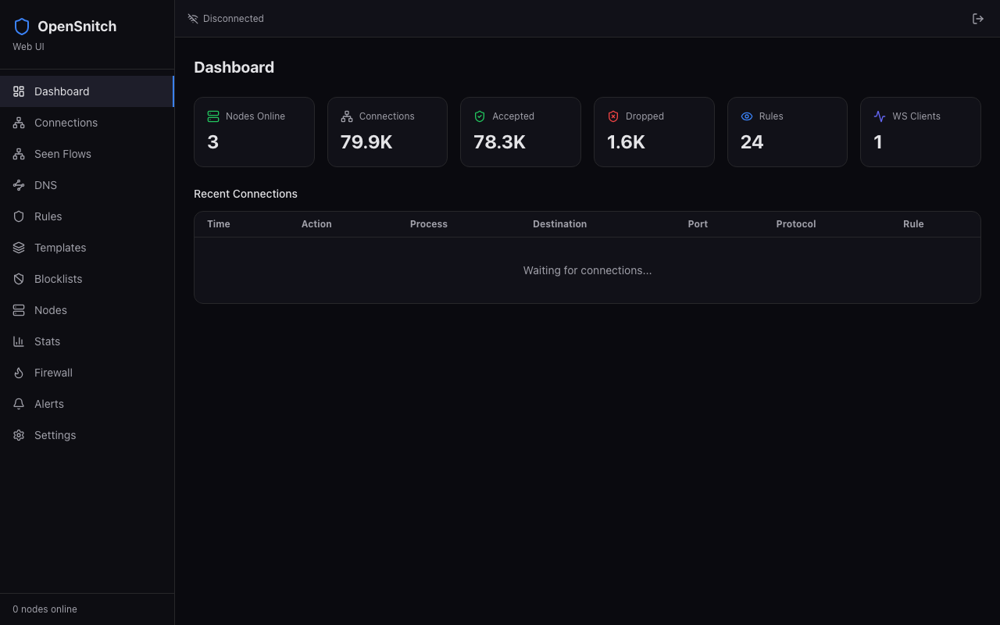
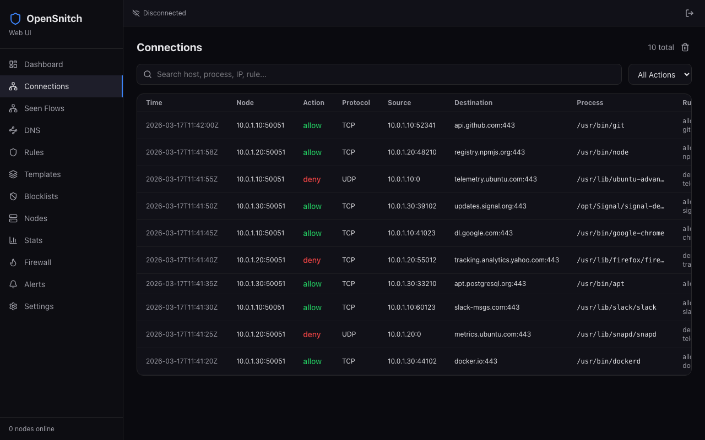
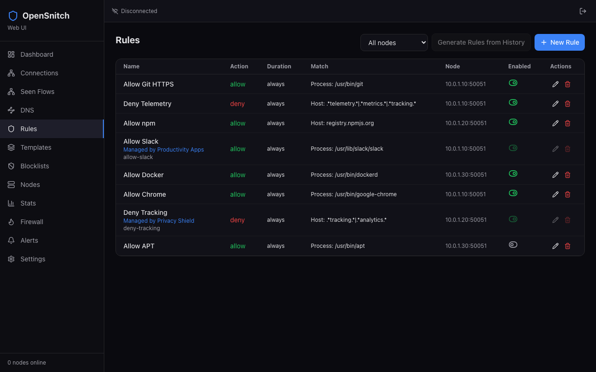
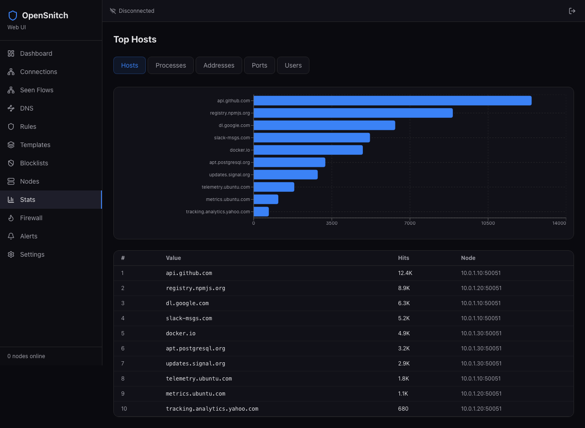

#  OpenSnitch Web UI

A self-hosted web dashboard for managing [OpenSnitch](https://github.com/evilsocket/opensnitch) firewall nodes — monitor connections, manage rules, and control your network from any browser.

<p align="center">
  
</p>

## What it does

OpenSnitch Web UI gives you a browser-based control panel for one or more OpenSnitch firewall daemons. Instead of managing rules and reviewing connections on each machine individually, you point your daemons at this server and handle everything from a single interface.

**Real-time connection monitoring** — Every connection your daemons intercept shows up in a live feed. You can see what process initiated the connection, where it's going, which rule matched, and whether it was allowed or denied. Search and filter across hosts, processes, IPs, and rules.

<p align="center">
  
</p>

**Multi-node management** — Connect multiple OpenSnitch daemon nodes to a single server. Each node reports its status, rules, and statistics independently. Toggle interception and firewall modes per node, manage node-specific rules, or apply rule templates across groups of nodes using tags.

**Rule templates** — Define reusable rule sets and attach them to nodes or tags. When you update a template, the changes propagate to all attached nodes automatically. Great for enforcing consistent policies across your infrastructure.

<p align="center">
  
</p>

**DNS visibility** — See every DNS query your nodes make, which servers they're using, and create rules to restrict DNS traffic to specific resolvers.

**Blocklists** — Import external blocklists (ad servers, trackers, malware domains) and apply them as firewall rules across your nodes.

**Interactive prompts** — When a daemon is in "ask" mode, connection prompts appear in the browser. You decide allow or deny in real time, with full process and destination details.

**Traffic statistics** — Visualize connections by host, process, port, protocol, and user. Built-in charts give you a quick overview of what's happening across your network.

<p align="center">
  
</p>

## Install

### Docker (recommended)

```bash
docker build -t opensnitch-web .
docker run -p 8080:8080 -p 50051:50051 opensnitch-web
```

Or with Docker Compose:

```bash
docker compose up -d
```

### Build from source

```bash
make all
./bin/opensnitch-web
```

Requires Go 1.22+, Node.js 20+, and GCC (for SQLite). See the [Makefile](Makefile) for all available targets.

### Default credentials

On first run, a unique admin password and JWT secret are auto-generated in `config.yaml`. Check the server log for the generated password.

Fallback defaults: `admin` / `opensnitch`

## Configuration

`config.yaml` is created automatically from `config.yaml.example` on first run with randomly generated secrets.

```yaml
server:
  http_addr: ":8080"           # HTTP listen address
  grpc_addr: "0.0.0.0:50051"  # gRPC listen address (for daemon nodes)
  grpc_unix: "/tmp/osui.sock"  # Unix socket for local daemon connections

database:
  path: "./opensnitch-web.db"  # SQLite database file
  purge_days: 30               # Auto-purge connections older than N days

auth:
  default_user: "admin"
  default_password: "opensnitch"       # Auto-generated on first run
  session_ttl: "24h"
  jwt_secret: "change-me-in-production" # Auto-generated on first run

ui:
  default_action: "deny"       # Default action for unhandled prompts
  prompt_timeout: 120          # Seconds before a prompt times out
```

## Development

Built with Go 1.22 (Chi, gRPC, SQLite) and React 19 (Vite, TypeScript, Tailwind CSS 4).

```bash
# Run backend + frontend dev server with HMR
make dev

# Build everything (frontend + Go binary)
make all

# Generate protobuf code (only if modifying .proto files)
make proto

# Lint frontend
cd web && npm run lint

# Clean build artifacts
make clean
```

## License

MIT
